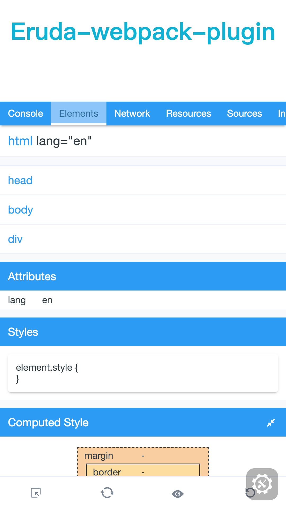

English | [中文](./README_CN.md)

# eruda-webpack-plugin
A webpack plugin of eruda to help you develop mobile app


## How to use

```js
npm i --save-dev eruda-webpack-plugin
```

```js
// webpack.config.js
const ErudaWebapckPlugin = reuire('eruda-webpack-plugin')
const HtmlWebpackPlutin = require('html-webpack-plugin')

const config = {
  devServer: {
        contentBase: path.join(__dirname, 'dist'),
        port: 10000
  },
  mode: "development",
  plugins: [
    new HtmlWebpackPlutin({
      template: path.resolve(__dirname, 'index.html')
    }),
    new ErudaWebapckPlugin()
  ]
}
```

Open `http://localhost:1000` in your browser, you can use `eruda` to debug your mobile app



## Using eruda's plugin

```js
new ErudaWebapckPlugin({
  plugins: ['fps', 'timing']
})
```

## Options

### force

`eruda-webpack-plugin` only works in `development` mode, if you need it in other modes, you can set `force` as `true`

```js
new ErudaWebpackPlugin({
  force: true
})
```

### tool

Choose which eruda's tools you want, by default all will be added.

```js
new ErudaWebpackPlugin({
  tool: ['console', 'elements']
})
```

### plugins

add eruda's plugin

```js
new ErudaWebapckPlugin({
  plugins: ['fps', 'timing']
})
```